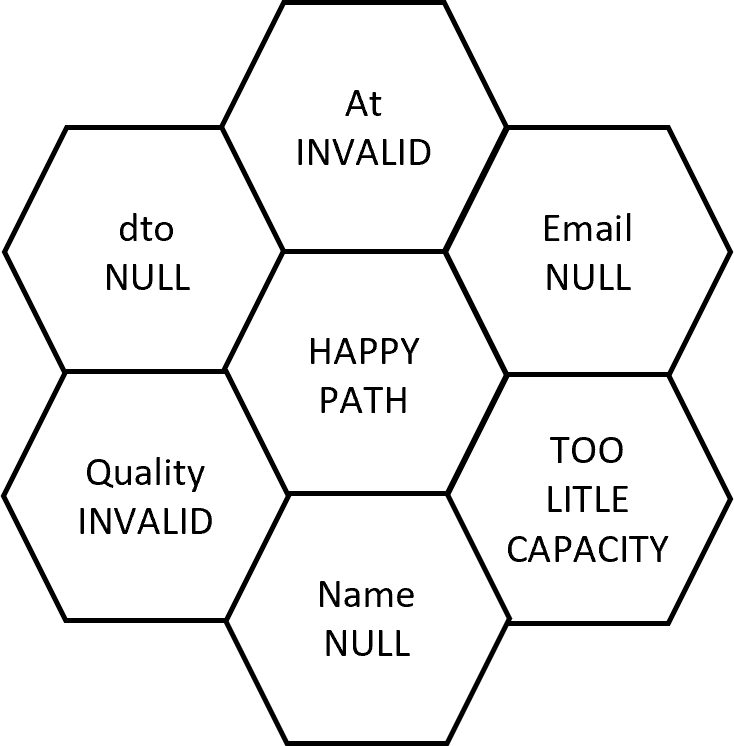

I kapittel 7 introduseres det som er tittelen på boken, hvordan skrive kode som passer inn i hodet ditt. Hvor følgende regel foreslås:

> I en kodebit (metode, klasse) skal det ikke skje mer enn 7 ting.

Koden under viser en POST metode i en controller som skal ta i mot bordreservasjoner (koden refaktoreres underveis i boken og er ikke representativ for kodekvalitet). Hvor mange ting skjer i denne koden?

```csharp
  public async Task<ActionResult> Post(ReservationDto dto)
        {
            if (dto is null)
                throw new ArgumentNullException(nameof(dto));
            if (!DateTime.TryParse(dto.At, out var d))
                return new BadRequestResult();
            if (dto.Email is null)
                return new BadRequestResult();
            if (dto.Quantity < 1)
                return new BadRequestResult();

            var reservations =
                await Repository.ReadReservations(d).ConfigureAwait(false);
            int reservedSeats = reservations.Sum(r => r.Quantity);
            if (10 < reservedSeats + dto.Quantity)
                return new StatusCodeResult(
                    StatusCodes.Status500InternalServerError);

            var r =
                new Reservation(d, dto.Email, dto.Name ?? "", dto.Quantity);
            await Repository.Create(r).ConfigureAwait(false);

            return new NoContentResult();
        }
```
Forfatteren benytter en hex blomst for å visualisere hva som skjer, og har plottet inn alle resultat fra de ulike grenene (if sjekker) i koden i tillegg til happy path. Dette tilsvarer "cyclomatic complexity metric" som statiske kodeanalyse verktøy benytter som metrikk på kodekompleksitet.



Hvis du forholder deg til regelen om at ikke mer enn 7 ting skal skje i en kodebit, så kan du ikke legge til noe mer i denne metoden uten å rydde opp. Ved å gjenomføre dette, kombinert med andre teknikker for lesbarhet, blir koden lettere å lese. Og poenget er at du SKAL rydde opp når det trengs der og da - hvis ikke vil du få en kodebase som sakte råtner på rot.

Dette er et eksempel på en regel, eller retningslinje som forfatteren kaller det. Han strekker seg langt for å behandle retningslinjene som harde regler, men bruker også hodet når et avvik kan forsvares.

Boken avslutter med en oppsummering av anbefalingene som gjennomgås:

* 50/72 regelen for Git commit meldinger
* 80/24 regelen for å skrive små metoder
* Arrange/Act/Assert pattern for test metoder
* Halvering som en metode for feilsøking
* Sjekklister for nye kodebaser
* Command Query Separation for metoder - enten er de en query metode som returnerer verdier eller så er de en command metode med sideeffekter som ikke returnerer noe
* Telling av variabler i en metode - hold antallet nede
* Cyclomatic Complexity som metrikk for kodekompleksitet
* Bruk av Decorator pattern for cross-cutting concerns (eks. logging) å unngå å forkludre domene objekter med infrastrukturkode
* Djevelens advokat for å utfordre testdekningen
* Bruk av feature flags for å skjule kode som ikke er ferdig
* Favoriser rene funksjoner (pure functions) for enklere testing og mer stabil kode
* Kommunikasjonshierarki for å kommunisere oppførsel og intensjon til koden
* Avvik fra regler
* Parse utypede data til strukturerte data så fort som mulig
* Rød, grønn, refaktorer aka Test Driven Development
* Oppdater regelmessig avhengigheter til eksterne bibliotekter
* Reproduser feil som tester
* Benytt kodegjennomgang som kvalitetssikring
* Benytt semantisk versjonering
* Ikke refaktorer testkode og produksjonskode samtidig
* Lever en hel vertikal så fort som mulig.
* Strangler pattern for refaktorering av legacy kode
* Benytt STRIDE for sikkerhetsvurdering av koden
* Begrens tiden koden er i en ugyldig state
* X-drevet utvikling - ha en driver for koden du skriver (tester, kodeanalyse etc.)
* X-ut metodenavn for å se hvor mye informasjon signaturen gir

Om du har lyst til å dykke ned i de ulike anbefalingene så er det en lettlest bok, og er du på Leikanger kontoret så kan du gjerne låne den.

